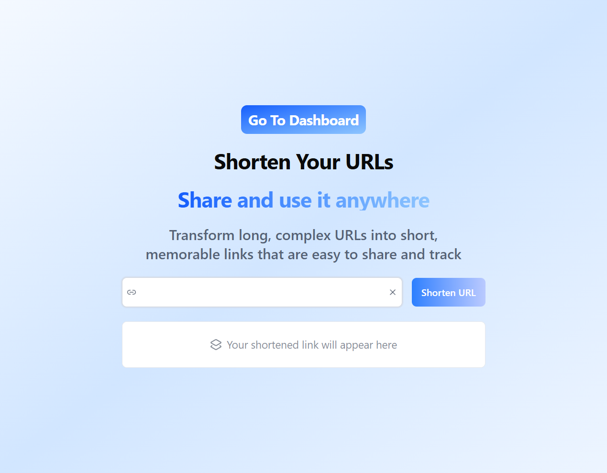
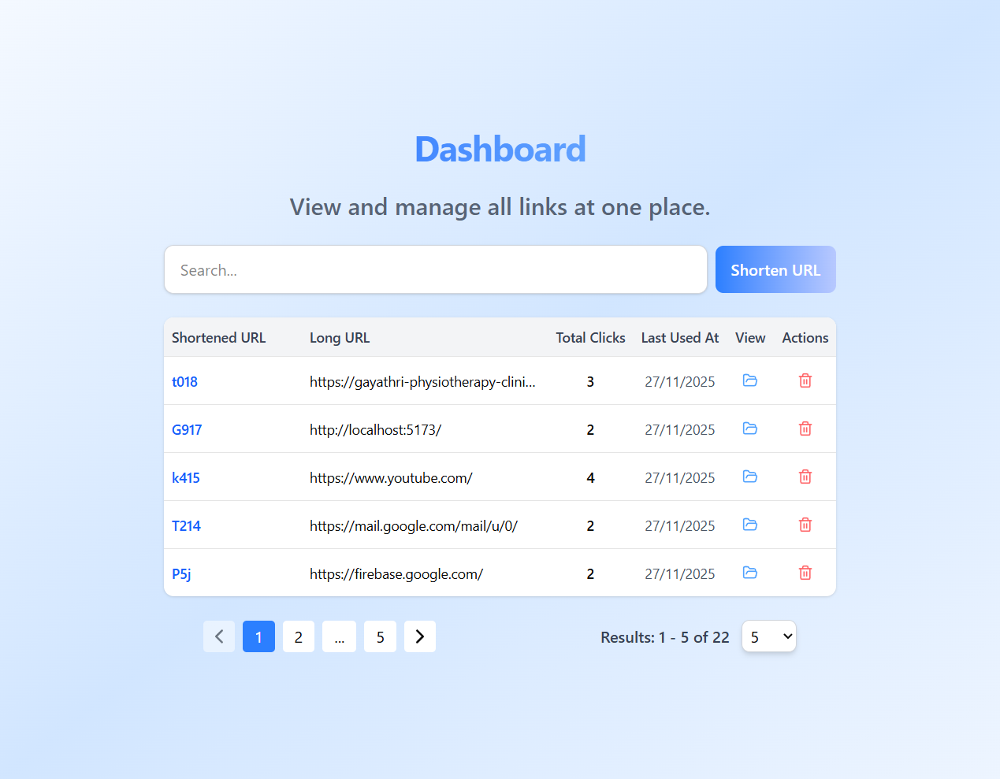
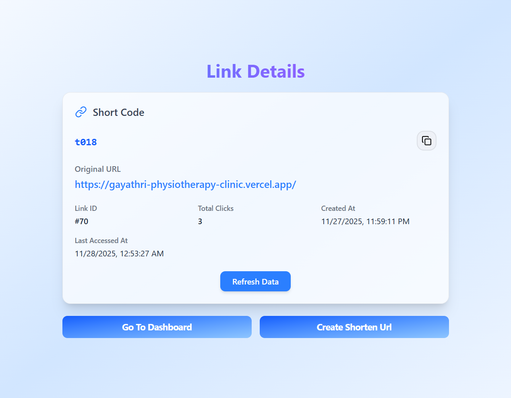

# 🔗 URL Shortener -- React + Node + Prisma + PostgreSQL

A complete and responsive **URL Shortening application** built using
**React, Tailwind CSS, Node.js, Prisma, and PostgreSQL**.\
The app allows users to shorten URLs, manage them through a dashboard,
track statistics, and experience smooth UI interactions powered by
efficient backend processing.

------------------------------------------------------------------------

## 🌐 Live Deployment

### Frontend

-   Home: https://url-shortener-psi-two.vercel.app/
-   Dashboard: https://url-shortener-psi-two.vercel.app/dashboard
-   Stats Page Example:
    https://url-shortener-psi-two.vercel.app/code/V5a
-   Frontend Health Check:
    https://url-shortener-psi-two.vercel.app/healthz

### Backend

-   Backend Health Check:
    https://url-shortener-backend-eta-livid.vercel.app/healthz

------------------------------------------------------------------------

## ✨ Features

### ⚡ URL Shortening

-   Shorten long URLs instantly.
-   Base62 short code generation.
-   Fast redirect handling via route `/:shortCode`.

### 📊 URL Dashboard

-   View all your shortened URLs.
-   Includes:
    -   Long URL
    -   Short URL
    -   Created Date
    -   Total Clicks
-   Ability to delete URLs.
-   **Server-side pagination**.
-   **Debounced search** - backend handles filtering + pagination.

### 📈 Statistics Page

-   View detailed stats for each short URL.
-   Displays:
    -   Total Clicks
    -   Last Accessed Time
    -   URL Details
-   Example: `/code/V5a`

### 🚀 Backend Optimizations

-   Search and pagination processed entirely on server.
-   Efficient Prisma queries.
-   Scales well for large datasets.

------------------------------------------------------------------------

## 📸 Screenshots

``` markdown



```

------------------------------------------------------------------------

## ▶️ Getting Started

### 1. Clone the Repository

``` bash
git clone https://github.com/SanthoshKumar-PS/url-shortener.git
cd url-shortener/Frontend
cd url-shortener/Backend
```

### 2. Install Dependencies

``` bash
npm install
```

### 3. Start Development Server

``` bash
npm run dev
```

------------------------------------------------------------------------

## 🛠️ Tech Stack

### Frontend

-   React
-   Typescript
-   Tailwind CSS
-   Framer Motion

### Backend

-   Node.js
-   Express
-   Prisma ORM
-   PostgreSQL
-   Vercel Serverless Functions

------------------------------------------------------------------------

## 📌 Pages Overview

| Page               | Path                | Description                          |
|--------------------|---------------------|--------------------------------------|
| **Home**           | `/`                 | Shorten long URLs                    |
| **Dashboard**      | `/dashboard`        | View all URLs with search + pagination |
| **Stats Page**     | `/code/:shortCode`  | Analytics for a specific URL         |
| **Redirect Route** | `/code/:shortCode`  | Redirects user to long/original URL  |
| **Frontend Health Check** | `/healthz`   | Check if frontend is running         |
| **Backend Health Check**  | `/healthz`   | Check backend server status          |


------------------------------------------------------------------------

## 🙋 Author

**Santhosh Kumar P S**

-   Email: **santhoshkumarsakthi2003@gmail.com**
-   GitHub: **https://github.com/SanthoshKumar-PS**

------------------------------------------------------------------------
